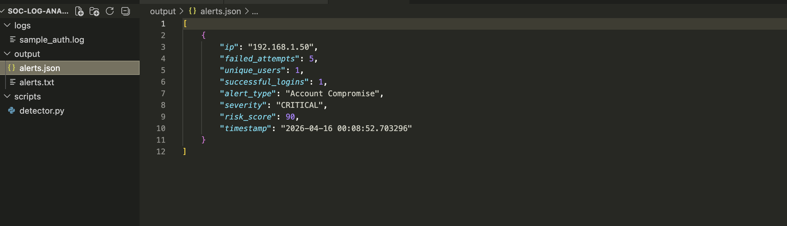

# SOC Multi-Attack Log Analyzer (Python)

  
  
  
  

---

## Overview

This project simulates a **SOC automation tool** that analyzes authentication logs to detect **multiple attack patterns**.

The tool performs **log parsing, event correlation, risk scoring, and alert generation**, similar to how SIEM platforms operate in real-world SOC environments.

---

## Real-World SOC Scenario

This project simulates a real-world credential attack scenario where:

- An attacker performs brute force attempts against authentication services  
- Multiple usernames are targeted (password spraying)  
- A successful login occurs after repeated failures  
- The system detects and flags a potential account compromise  

This reflects **real SOC incidents seen in enterprise environments**, such as:

- Ransomware initial access  
- Credential stuffing attacks  
- Unauthorized remote access attempts

---

## Objectives

- Detect authentication-based attacks  
- Correlate failed and successful login activity  
- Simulate SOC detection engineering  
- Generate prioritized alerts for incident response  

---

## Supported Attack Detections

- Brute Force Attack  
- Password Spraying  
- Successful Login After Failures (**Account Compromise**)  
- User Enumeration Attempts  

---

## Advanced Detection Features (SOC Level 2)

- Time-based detection logic  
- Risk scoring for prioritization  
- Severity classification (Low / Medium / High / Critical)  
- Multi-event correlation (failures + success)  
- JSON-based alert output (SIEM-style)  

---

## Detection Logic

- Detects **"Failed password"** events  
- Extracts **source IP addresses and usernames**  
- Tracks **unique users targeted per IP**  
- Detects **successful logins after multiple failures**  
- Applies **threshold-based detection (≥ 5 attempts)**  

---

## Detection Logic Breakdown

### 1. Brute Force Detection
- Tracks failed login attempts per IP  
- Triggers alert when attempts ≥ 5  
- Identifies automated attack behavior  

### 2. Password Spraying Detection
- Tracks number of unique users targeted  
- Flags multiple user attempts from one IP  
- Indicates credential spraying activity  

### 3. Success After Failure (CRITICAL)
- Detects successful login after repeated failures  
- Strong indicator of account compromise  
- High-priority SOC alert  

### 4. User Enumeration Detection
- Detects multiple username attempts  
- Identifies reconnaissance behavior  

---

## How It Works

1. Log file is ingested  
2. Failed login attempts are extracted  
3. IPs and usernames are correlated  
4. Successful logins are tracked  
5. Detection rules are applied  
6. Alerts are generated and stored  

---

## Detection Output Example

- [ALERT] Brute Force Attack from 192.168.1.50 (5 attempts)
- [CRITICAL] Account Compromise Detected from 192.168.1.50

---

## Project Demonstration

### Script Execution

---

### Detection Results

---

### Alerts Output File

---

### Sample Log File

---

### JSON Alert Output

---

## SOC Workflow Simulation

Detection → Alert → Investigation → Response  

1. Logs ingested  
2. Detection rules triggered  
3. Alerts generated and prioritized  
4. Analyst investigates suspicious activity  
5. Potential compromise identified  
6. Incident escalated  

---

## Tools & Skills

- Python (Log Analysis & Automation)  
- Regex (Pattern Detection)  
- SOC Detection Engineering  
- Threat Detection & Correlation  
- Incident Analysis  
- MITRE ATT&CK Mapping  

---

## False Positives Consideration

- Administrative login attempts  
- Security testing activity  
- Misconfigured services  

---

## Detection Improvements (Future Enhancements)

- Time-window correlation (real SIEM logic)  
- GeoIP enrichment  
- SIEM integration (Splunk / Sentinel)  
- Real-time alerting (Slack / Email)  

---

## MITRE ATT&CK Mapping

| Technique | ID |
|----------|----|
| Brute Force | T1110 |
| Valid Accounts | T1078 |
| Credential Access | T1003 |

---

## Detection Scenario

1. Attacker performs brute force attempts  
2. Gains access using valid credentials  
3. System detects compromise using correlation logic  

---

## SOC Analyst Summary

This project demonstrates how **Python can be used to build a SOC-level detection engine**, capable of:

- Multi-event correlation  
- Risk-based alerting  
- Attack detection and prioritization  
- Security automation  

---

## SOC Analyst Value

This project demonstrates:

- Ability to build detection logic from raw logs  
- Understanding of attacker behavior (TTPs)  
- Experience with alert prioritization and triage  
- Practical implementation of SOC workflows  

This aligns with responsibilities of a Tier 1 / Tier 2 SOC Analyst role.

---

## Author

**Tejinder Singh**  
SOC Analyst | SIEM • Threat Detection • Incident Response  
