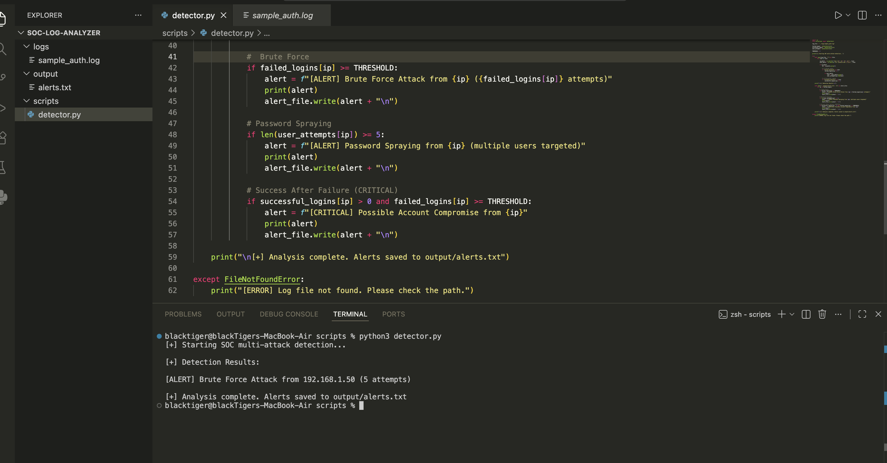
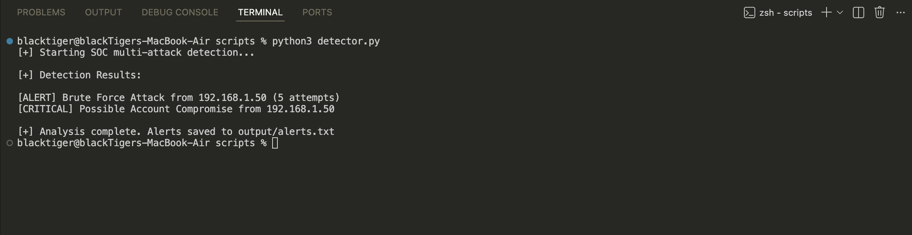
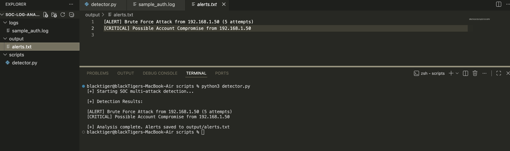
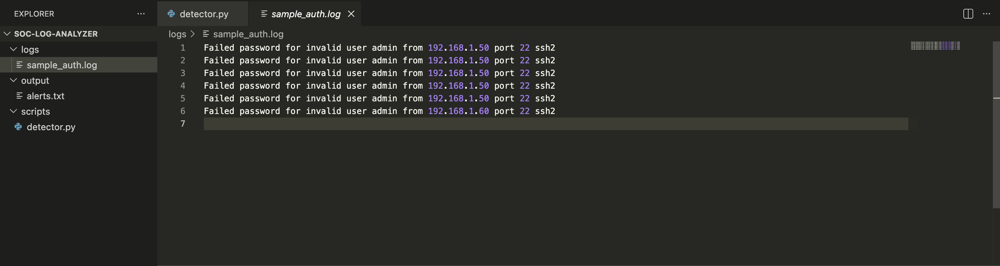

# SOC Multi-Attack Log Analyzer (Python)

  
  
  
  

---

## Overview

This project simulates a **SOC automation tool** that analyzes authentication logs to detect **multiple attack patterns**.

The tool parses log data, correlates events, and generates alerts for suspicious activity such as brute force attacks, password spraying, and potential account compromise.

---

## Objectives

- Detect multiple authentication-based attacks  
- Simulate SOC detection engineering using Python  
- Correlate failed and successful login activity  
- Automate alert generation for incident response  

---

## Supported Attack Detections

- Brute Force Attack  
- Password Spraying  
- Successful Login After Failures (**Account Compromise**)  
- User Enumeration Attempts  

---

## Detection Logic

- Detects **"Failed password"** events  
- Extracts **source IP addresses and usernames**  
- Tracks **unique users targeted per IP**  
- Detects **successful logins after multiple failures**  
- Applies **threshold-based detection (≥ 5 attempts)**  

---

## How It Works

1. Log file is ingested  
2. Failed login attempts are extracted  
3. Usernames and IPs are correlated  
4. Successful logins are tracked  
5. Detection rules are applied  
6. Alerts are generated and stored  

---

## Detection Output Example

- [ALERT] Brute Force Attack from 192.168.1.50 (5 attempts)
- [CRITICAL] Account Compromise Detected from 192.168.1.50 (successful login after brute force)

---

## Project Demonstration

### Script Execution

---

### Detection Results

---

### Alerts Output File

---

### Sample Log File

---

## SOC Use Case

This tool simulates how SOC analysts:

- Detect brute force and password spraying attacks  
- Correlate authentication events across systems  
- Identify potential account compromise  
- Automate detection workflows for faster response  

---

## False Positives Consideration

- IT administrators performing multiple login attempts  
- Security testing or lab-based simulation  
- Misconfigured services retrying authentication  

---

## Detection Improvements (Future Enhancements)

- Time-based correlation (e.g., 5 attempts within 1 minute)  
- GeoIP analysis for attacker location  
- Integration with SIEM platforms (Splunk / Sentinel)  
- Real-time alerting via email or Slack  

---

## MITRE ATT&CK Mapping

| Technique | ID |
|----------|----|
| Brute Force | T1110 |
| Valid Accounts | T1078 |
| Credential Dumping | T1003 |

---

## Detection Scenario

This project simulates a real-world attack where:

1. An attacker performs brute force attempts  
2. Eventually gains access using valid credentials  
3. The system detects and flags a potential account compromise  

This demonstrates **SOC-level correlation between failed and successful authentication events**.

---

## SOC Analyst Summary

This project demonstrates how **Python can be used to build a multi-detection SOC tool**, capable of identifying and correlating authentication-based attacks.

It highlights:

- Detection engineering fundamentals  
- Log analysis and event correlation  
- Alert generation and prioritization  
- Security automation in SOC environments  

---

## Author

**Tejinder Singh**  
SOC Analyst | SIEM • Threat Detection • Incident Response  
